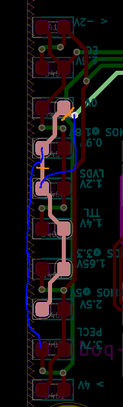

# WTF?

This is a reimplementation of the Logic Analyzer pod for the MSO5k scopes.

The schematic and PCB is in kicad 5 format.

# Errata

* E1: The volt meter LEDs D407/D408 were paralelled with D405/D406,
this makes it impossible to light them up individually.

* E2: The ATtiny85 should not have a pulldown on ~RESET, it has a weak internal pullup, so remove R417

# Versions

There are a number of versions each in its own subdir:

## lmh7324-8ch
* 8 channel frontend pod
* On a 4 layer board
* With lmh7324 comparators
* And a simple volt-meter that shows the threshold voltage.

## breakout
* Board for converting the 2x25 2.54 mm pitch connector on the scope to two 2x13 pin 1.27 mm pitch connectors.

# Unfinished experiments

## lmh7322
* 16 channel frontend pod
* Pretty close clone of the original
* One-sided load
* On a 4 layer board
* Direct 2x50 2.54mm ribbon connector to the scope
* Status: Done, except for silkscreen

## lmh7322-8ch
* 8 channel frontend pod
* Half the channels to make the ribbon smaller and nicer to work with.
* One-sided load
* On a 4 layer board
* Status: Nope

## lmh7324
* 16 channel frontend pod
* Using lmh7324 for greater density and lower cost.
* One-sided load
* On a 4 layer board
* Status: Nope

